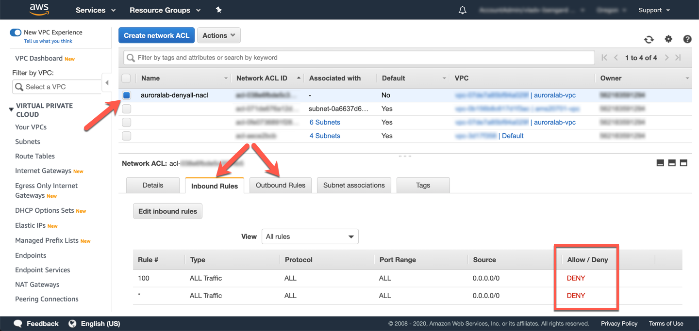
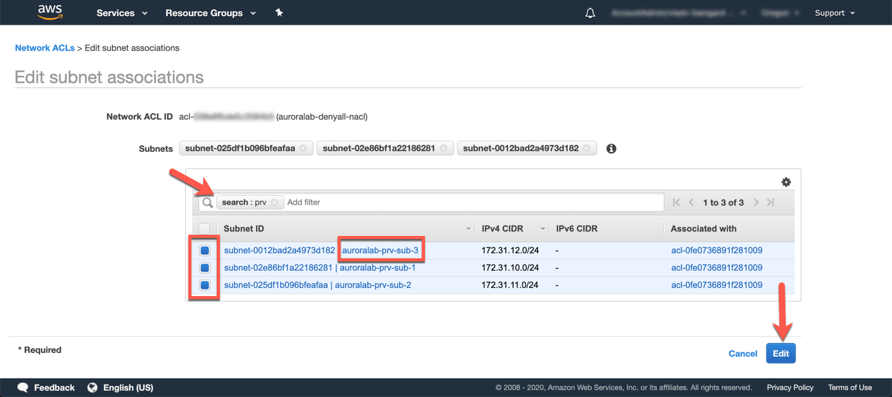
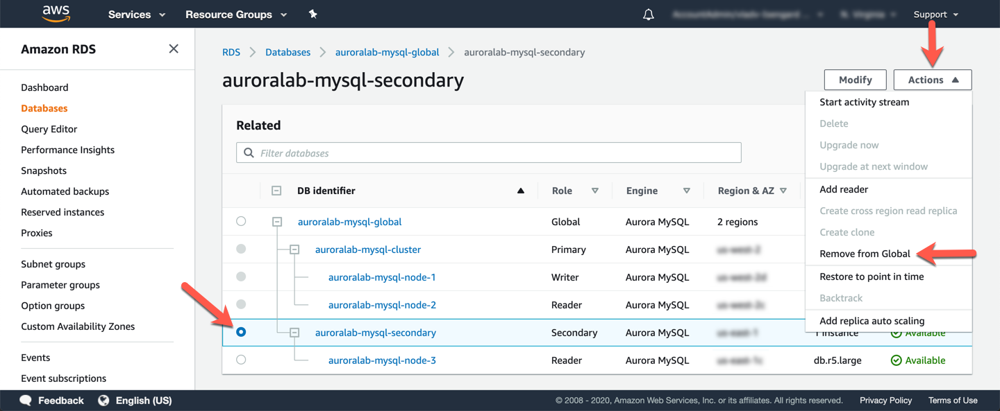
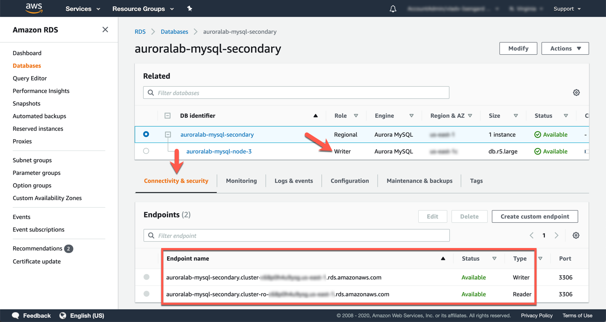

# Fail Over an Aurora Global Database

When used in combination with in-region replicas, an Aurora DB cluster provides automatic failover capabilities within the region. With Aurora Global Database, you can perform a manual failover to the DB cluster in your secondary region, such that your database can survive in the unlikely scenario of an entire region's infrastructure or service becoming unavailable.

Combined with an application layer that is deployed cross-region (via immutable infrastructure or (<a href="https://docs.aws.amazon.com/AWSEC2/latest/UserGuide/CopyingAMIs.html" target="_blank">copying your AMIs cross-region</a>), you can further increase your applications' availability while maintaining data consistency.

This lab contains the following tasks:

1. Inject a failure in the primary region
2. Promote the secondary DB cluster

This lab requires the following prerequisites:

* [Get Started](/prereqs/environment/) (choose the **Deploy Global DB** option)
* [Connect to the Session Manager Workstation](/prereqs/connect/)
* [Deploy an Aurora Global Database](/global/deploy/)


## 1. Inject a failure in the primary region

If you are not already connected to the Session Manager workstation command line, please connect [following these instructions](/prereqs/connect/) in the **primary region**. Once connected, run the command below, replacing the ==[clusterEndpont]== placeholder with the cluster endpoint of your DB cluster.

!!! warning "Region Check"
    Ensure you are still working in the **primary region**, especially if you are the links in this guide to open the service console at the right screen.

```shell
mysql -h[clusterEndpoint] -u$DBUSER -p"$DBPASS" mylab
```

!!! tip "Where do I find the cluster endpoint (or any other placeholder parameters)?"
    Since you are working with an Aurora Global Database, there are multiple endpoints, across the primary and secondary regions you will have to keep track of. Check the end of the [Deploy a Global Database](global/deploy/) lab for instructions on how to find the endpoints of the cluster.

Once connected to the database, use the code below to create a table. Run the following SQL queries:

```sql
DROP TABLE IF EXISTS failovertest1;
CREATE TABLE failovertest1 (
  pk INT NOT NULL AUTO_INCREMENT,
  gen_number INT NOT NULL,
  some_text VARCHAR(100),
  input_dt DATETIME,
  PRIMARY KEY (pk)
);
INSERT INTO failovertest1 (gen_number, some_text, input_dt)
VALUES (100,"region-1-input",now());
COMMIT;
SELECT * FROM failovertest1;
```

Take a note of the query results, you'll use them later to compare.

You can simulate an in-region failure using several mechanisms. See the [Test Fault Tolerance](/provisioned/failover/) lab for hands-on exercises to test that out. However, in this case you will simulate a longer term and larger scale failure (however infrequent), and the best way to do this is to stop all ingress/egress data traffic in and out of the Aurora Global Database's primary DB cluster. Your lab environment contains a <a href="https://docs.aws.amazon.com/vpc/latest/userguide/vpc-network-acls.html" target="_blank">VPC Network ACL</a> (NACL) with a specific **DENY ALL** rule that will block all ingress/egress traffic out of the associated subnets. This will essentially emulate a wider failure that will render your primary region DB cluster unavailable to your applications.

Open the <a href="https://console.aws.amazon.com/vpc/home#acls:sort=networkAclId" target="_blank">VPC service console</a> in the **primary region** at the **Network ACLs** section. You should see a NACL named **auroralab-denyall-nacl**, and that it is not currently associated with any subnets. Select it by checking the box next to the name and review both the **Inbound Rules** and **Outbound Rules** tabs in the bottom detail panel. You should see that they're set to *DENY* for ALL traffic.

!!! warning "Region Check"
    Ensure you are still working in the **primary region**, especially if you are following the links above to open the service console at the right screen.

<span class="image"></span>

Toggle to the **Subnet associations** tab of the selected NACL in the detail panel, and then click the **Edit subnet associations** button.

The Aurora DB cluster is configured to use the **private subnets** configured for your lab environment, and governed by RDS DB subnet group created for your lab environment. All these subnets are named with the prefix `auroralab-prv-sub-`, followed by a number corresponding to the Availability Zone. You may need to drag the **Subnet ID** column wider to see the names.

Select all subnets that begin with this name prefix. You can also simply use the search box to filter on any subnets with the name **prv** and then select them. Next, click on the **Edit** button to confirm the associations.

<span class="image"></span>

Once associated, the NACL rules take effect immediately and will render the resources within the private subnets unreachable. Your connection to the database in the Session Manager command line should eventually break with an error message indicating that the client lost connection to the server.

## 2. Promote the secondary DB cluster

You are simulating a prolonged regional infrastructure or service level failure, at which point, you would typically opt to perform a regional failover to your DR site for your application and database stacks. Next, you will promote the **secondary DB cluster**, in the **secondary region** to an independent regional DB cluster.

Open the <a href="https://console.aws.amazon.com/rds/home?region=us-east-1#database:id=auroralab-mysql-secondary;is-cluster=true" target="_blank">Amazon RDS service console</a> at the MySQL DB cluster details page of the **secondary DB cluster**. 

!!! warning "Region Check"
    Ensure you are still working in the **secondary region**, especially if you are following the links above to open the service console at the right screen.

??? tip "Why does the status of my primary DB cluster and DB instance still report as <i>Available</i>?"
    You might also notice that in your RDS console it will still report the primary region DB cluster and DB instance as **Available**, that is because you are merely simulating a failure by blocking all networking access via NACLs, and the blast radius of such a simulation is limited only to your AWS Account, specifically to your VPC and its affected subnets; the RDS/Aurora service and its internal health checks are provided by the service control plane itself and will still report the DB cluster and DB instance as healthy because there is no *real outage*.

With the secondary DB Cluster `auroralab-mysql-secondary` selected, click on the **Actions** menu, then select **Remove from Global**.

<span class="image"></span>

A message will pop up asking you to confirm that this will break replication from the primary DB cluster. Confirm by clicking on **Remove and promote**.

<span class="image"></span>

The promotion process should take less than 1 minute. Once complete, you should be able to see the previously secondary DB cluster is now labeled as **Regional** and the DB instance is now a **Writer** node.

Click on the newly promoted DB cluster. Under the **Connectivity and security** tab, the **Writer** endpoint should now be listed as **Available**. Copy and paste the endpoint string into your notepad.

<span class="image"></span>

Open an additional command line session to the Session Manager workstation in the **secondary region**. See [Connect to the Session Manager](/prereqs/connect/), for steps how to create a Session Manager command line session, but make sure you use the **secondary region**.

!!! warning "Region Check"
    Ensure you are still working in the **secondary region**, especially if you are the links in this guide to open the service console at the right screen.

Once connected, you need to set up the database credentials on the EC2 workstation in the secondary region. If you have created the original primary DB cluster manually, you have performed a similar step at that time. Run the following commands, replacing the placeholders with values as indicated in the below table:

Placeholder | Where to find it
----- | -----
==[secretArn]== | If you are participating in a formal workshop, and the lab environment was provisioned for you using Event Engine, the value of the Secret ARN may be found on the Team Dashboard in Event Engine. Otherwise you will find it in the Outputs of the CloudFormation stack you used to provision the lab environment. The value starts with `arn:aws:secretsmanager:`.
==[primaryRegion]== | The identifier of the **primary region** you are using, click on the name in the top right corner of the console. You'll find it next to the name, for example `us-west-2`, although your region may vary.


```shell
CREDS=`aws secretsmanager get-secret-value --secret-id [secretArn] --region [primaryRegion] | jq -r '.SecretString'`
export DBUSER="`echo $CREDS | jq -r '.username'`"
export DBPASS="`echo $CREDS | jq -r '.password'`"
echo "export DBPASS=\"$DBPASS\"" >> /home/ubuntu/.bashrc
echo "export DBUSER=$DBUSER" >> /home/ubuntu/.bashrc
```

Next, run the command below, replacing the ==[newClusterEndpont]== placeholder with the cluster endpoint of your newly promoted DB cluster.

```shell
mysql -h[newClusterEndpoint] -u$DBUSER -p"$DBPASS" mylab
```

!!! tip "Where do I find the cluster endpoint (or any other placeholder parameters)?"
    Since you are working with an Aurora Global Database, there are multiple endpoints, across the primary and secondary regions you will have to keep track of. Check the end of the [Deploy a Global Database](global/deploy/) lab for instructions on how to find the endpoints of the cluster.

Once connected to the database, use the code below to create a table. Run the following SQL queries:

```sql
SELECT * FROM failovertest1;
```

Note the query results, this should return the new table and record you entered into the Database shortly before the simulated failure.

Insert a new record to this table. Copy and paste the following query and run it. What do you expect the results to be?

```sql
INSERT INTO failovertest1 (gen_number, some_text, input_dt)
VALUES (200,"region-2-input",now());
SELECT * FROM mylab.failovertest1;
```
You should notice both your previous results before failover and the new record. Your application can now serve both read and write queries from what used to be your **secondary region** and serve your users as normal, during a region-wide disruption!
